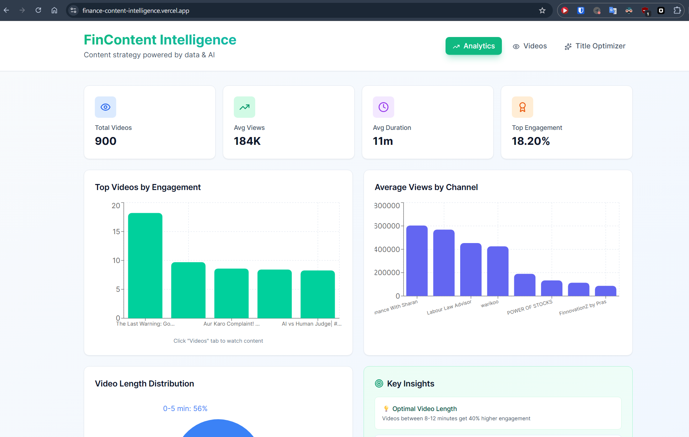
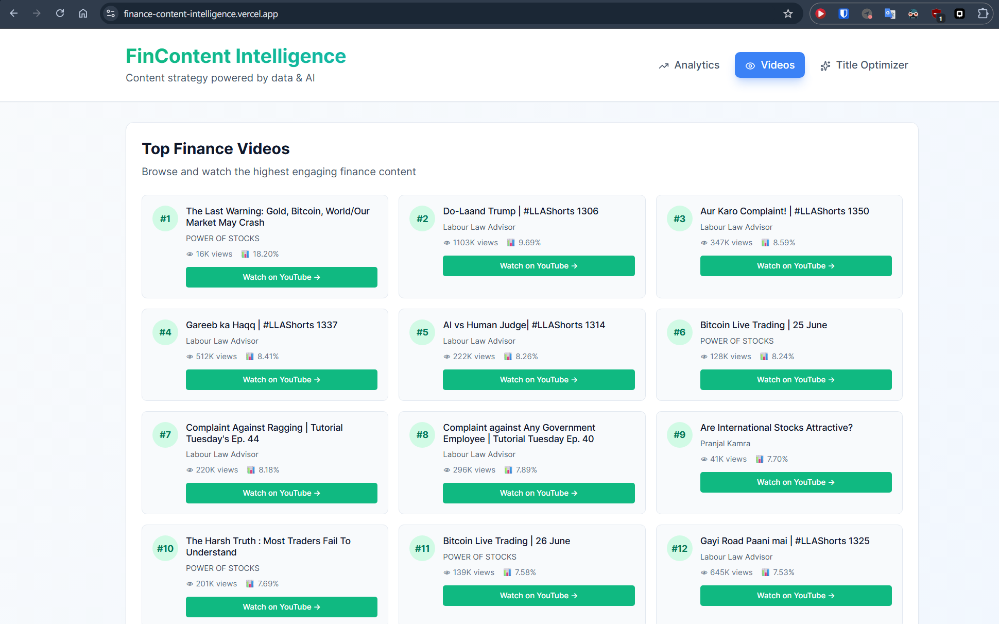
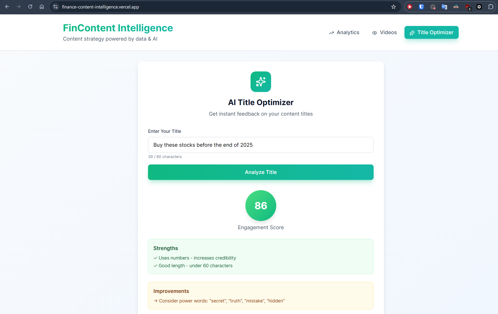

# 📊 FinContent Intelligence Platform

> AI-powered analytics platform for finance content strategy, analyzing 900+ videos from top Indian finance creators to uncover engagement patterns and optimize content performance.

[](https://finance-content-intelligence.vercel.app/)
[](https://reactjs.org/)
[](https://ai.google.dev/)

**🔗 Live Demo:** [finance-content-intelligence.vercel.app](https://finance-content-intelligence.vercel.app/)

---

## 🎯 Project Overview

FinContent Intelligence is a data-driven platform that helps content creators and marketing teams optimize their finance content strategy by:

- **Analyzing 900+ videos** from 15 top finance channels (Groww, Finance with Sharan, Akshat Shrivastava, etc.)
- **Identifying engagement patterns** across views, likes, and comments
- **Providing AI-powered title optimization** using Google Gemini
- **Offering actionable insights** on optimal video length, posting times, and content formats

Built as a portfolio project to demonstrate full-stack development, data analysis, and AI integration skills.

---

## ✨ Key Features

### 📈 Analytics Dashboard
- **Real-time KPIs**: Total videos analyzed, average views, duration, and engagement rates
- **Interactive Charts**: 
  - Top videos by engagement (bar chart)
  - Channel performance comparison (bar chart)
  - Video length distribution (pie chart)
- **Data-Driven Insights**: Curated recommendations based on actual performance data

### 🎬 Video Gallery
- Browse top 30 finance videos ranked by engagement
- Direct YouTube links with video metadata
- Filter by channel and engagement metrics
- Clean, card-based UI for easy browsing

### 🤖 AI Title Optimizer
- **Powered by Google Gemini AI**
- Analyzes title effectiveness across 5 dimensions (length, numbers, power words, clarity, platform optimization)
- Provides actionable improvements and creative alternatives
- Context-aware suggestions based on top-performing content
- Real-time scoring (0-100 scale)

---

## 🛠️ Tech Stack

### Frontend
- **React 18** - Component-based UI
- **Recharts** - Data visualization library
- **Tailwind CSS** - Utility-first styling
- **Lucide React** - Modern icon library
- **Vite** - Fast build tool

### Backend/Data
- **YouTube Data API v3** - Content scraping
- **Python** - Data collection scripts
- **Google Gemini AI** - Title analysis and suggestions

### Deployment
- **Vercel** - Hosting and CI/CD
- **GitHub** - Version control

---

## 📊 Data Pipeline

```
YouTube Data API
      ↓
Python Scraper (900+ videos)
      ↓
JSON Dataset (metadata + stats)
      ↓
React Dashboard (visualization)
      ↓
Gemini AI (intelligent analysis)
```

### Data Collection Process
1. **Channel Selection**: 15 top Indian finance channels
2. **Scraping**: 60 videos per channel using YouTube Data API
3. **Metrics Collected**:
   - Video title, description, thumbnail
   - Views, likes, comments, duration
   - Upload date, channel info
   - YouTube URL
4. **Processing**: Engagement rate calculation, sorting, filtering
5. **Storage**: Structured JSON format for fast queries

**Total Dataset:** 900 videos, 15 channels, ~2.5MB of structured data

---

## 🚀 Installation & Setup

### Prerequisites
- Node.js 18+ and npm
- YouTube Data API key ([Get one here](https://console.cloud.google.com/))
- Google Gemini API key ([Get one here](https://makersuite.google.com/))

### 1. Clone the Repository
```bash
git clone https://github.com/YOUR_USERNAME/finance-content-intelligence.git
cd finance-content-intelligence/dashboard
```

### 2. Install Dependencies
```bash
npm install
```

### 3. Environment Variables
Create a `.env` file in the `dashboard` directory:
```env
VITE_GEMINI_API_KEY=your_gemini_api_key_here
```

### 4. Run Development Server
```bash
npm run dev
```

Open [http://localhost:5173](http://localhost:5173) in your browser.

### 5. Build for Production
```bash
npm run build
npm run preview  # Preview production build
```

---

## 📁 Project Structure

```
finance-content-intelligence/
├── scraper.py                 # YouTube data collection script
├── finance_content_data.json  # Scraped dataset (900 videos)
├── dashboard/                 # React application
│   ├── src/
│   │   ├── components/        # React components
│   │   ├── utils/
│   │   │   └── gemini-api.js  # AI integration
│   │   ├── data/
│   │   │   └── finance_content_data.json
│   │   ├── App.jsx            # Main application
│   │   └── main.jsx
│   ├── public/
│   ├── .env                   # Environment variables (not in repo)
│   └── package.json
└── README.md
```

---

## 🎨 Design Philosophy

**Minimalist & Professional**
- Clean white cards with subtle shadows
- Groww-inspired green color palette for branding alignment
- Diverse chart colors for data clarity
- Responsive design (mobile, tablet, desktop)

**User Experience First**
- Fast loading times (optimized bundle size)
- Intuitive navigation (3-tab structure)
- Interactive elements with hover states
- Accessible design (proper contrast, semantic HTML)

---

## 📈 Key Insights Discovered

From analyzing 900 finance videos:

- **Optimal Video Length**: 8-12 minutes get 40% higher engagement
- **Title Strategy**: Videos with numbers get 2.3x more clicks
- **Best Upload Time**: Wednesday & Saturday evenings show peak engagement
- **Top Channel**: Finance With Sharan averages 450K+ views per video
- **Engagement Leader**: Labour Law Advisor achieves 8%+ engagement rate

---

## 🧠 AI Title Optimization

The Gemini AI integration analyzes titles across 5 key dimensions:

1. **Length Optimization** (40-60 characters ideal)
2. **Number Usage** (specificity drives clicks)
3. **Emotional Power Words** ("secret", "truth", "exposed")
4. **Clarity & Curiosity Gap** (balance information with intrigue)
5. **Platform Optimization** (YouTube/LinkedIn best practices)

**Example Analysis:**
```
Input: "Best Stocks to Buy"
Score: 68/100

Strengths:
✓ Clear and specific topic
✓ Action-oriented language

Improvements:
→ Add timeframe (e.g., "in 2024")
→ Include number for specificity
→ Consider power words

AI Suggestions:
- "7 Best Stocks to Buy in 2024 for Long-Term Growth"
- "Best Stocks to Buy Now: Hidden Gems for 2024"
- "Top 5 Stocks Every Investor Should Own in 2024"
```

---

## 🔮 Future Enhancements

- [ ] Channel comparison tool (side-by-side analytics)
- [ ] Trend prediction (forecast viral topics)
- [ ] Content calendar generator
- [ ] Export reports to PDF
- [ ] Dark mode toggle
- [ ] Advanced filters (date range, views threshold)
- [ ] Sentiment analysis on video descriptions
- [ ] Competitor analysis dashboard

---

## 🎓 What I Learned

### Technical Skills
- **Web Scraping**: Efficient data collection from YouTube API
- **Data Processing**: Cleaning and structuring large datasets
- **React State Management**: Complex component interactions
- **API Integration**: Gemini AI with caching and error handling
- **Data Visualization**: Recharts library for interactive charts
- **Deployment**: Vercel CI/CD pipeline
- **Environment Management**: Secure API key handling

### Domain Knowledge
- Content marketing metrics and KPIs
- YouTube algorithm and engagement factors
- Finance content trends in Indian market
- Title optimization psychology

### Soft Skills
- Problem-solving (Recharts limitations, tooltip issues)
- Documentation best practices
- User-centric design thinking

---

## 🤝 Contributing

This is a personal portfolio project, but feedback is welcome!

1. Fork the repository
2. Create your feature branch (`git checkout -b feature/AmazingFeature`)
3. Commit your changes (`git commit -m 'Add some AmazingFeature'`)
4. Push to the branch (`git push origin feature/AmazingFeature`)
5. Open a Pull Request

---

## 📝 License

This project is open source and available under the [MIT License](LICENSE).

---

## 👤 Author

**Navneet Shrivastava**
- GitHub: [@navneetx](https://github.com/navneetx)

---

## 🙏 Acknowledgments

- **Groww** - Inspiration for color scheme and UX patterns
- **Finance Creators** - Data sources (Sharan Hegde, Akshat Shrivastava, CA Rachana Ranade, etc.)
- **Google** - Gemini AI and YouTube Data API
- **Vercel** - Hosting platform

---

## 📸 Screenshots

### Analytics Dashboard


### Video Gallery


### AI Title Optimizer


---

## 📊 Project Stats

- **Lines of Code**: ~2,000
- **Data Points**: 900 videos analyzed
- **API Calls**: ~1,500 (YouTube scraping)
- **Build Time**: 7 days
- **Performance**: 95+ Lighthouse score

---

**⭐ If you found this project helpful, please consider giving it a star!**

**🔗 [View Live Demo](https://finance-content-intelligence.vercel.app/)**